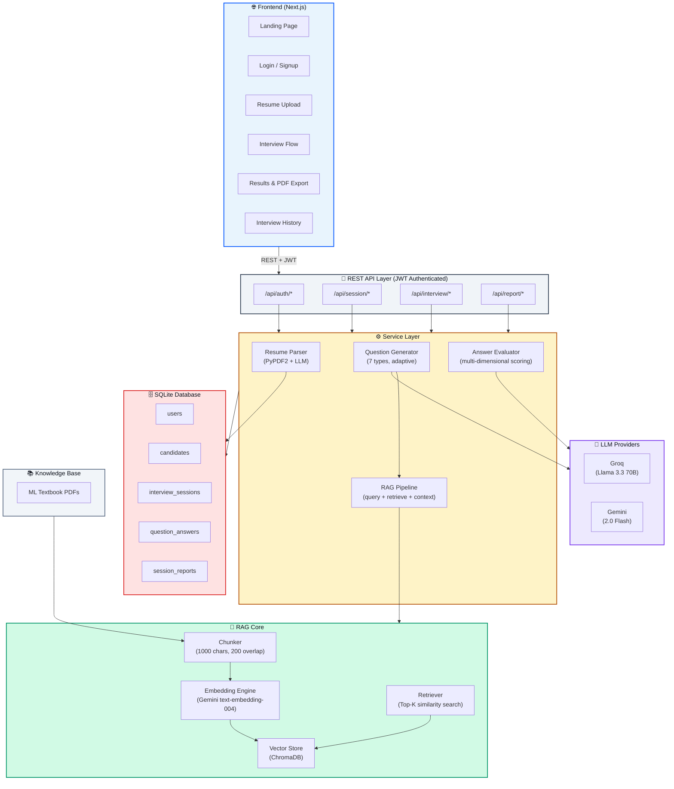

# 🤖 AI-Powered Role-Based Candidate Screening System

An intelligent interview screening platform that uses **Retrieval-Augmented Generation (RAG)** to dynamically generate technical interview questions from role-specific knowledge bases, evaluate candidate responses, and produce comprehensive assessment reports.

> Built with **Next.js** (Frontend) + **FastAPI** (Backend) + **ChromaDB** (Vector Store) + **Groq/Gemini** (LLM)


---

## 📋 Table of Contents

- [Demo Video](#-demo-video)
- [Features](#-features)
- [Demo Video](#-demo-video)
- [System Architecture](#-system-architecture)
- [Tech Stack](#-tech-stack)
- [Setup Instructions](#-setup-instructions)
- [Project Structure](#-project-structure)
- [Key Design Decisions](#-key-design-decisions)
- [API Documentation](#-api-documentation)
- [Database Schema](#-database-schema)

---

## 🎥 Demo Video

Watch the comprehensive 12-minute walkthrough of the AI-Powered Candidate Screening System:

**[▶️ Click here to watch the Demo Video](https://drive.google.com/file/d/1BkcxLh2XuHxGU-F06hZ0MHOfbZzHdyG0/view?usp=sharing)**

### Video Walkthrough Highlights:
- **0:00 – 1:30**: Introduction & The Problem (Standard vs. RAG-based Screening)
- **1:30 – 4:00**: System Architecture Overview (Next.js, FastAPI, ChromaDB, RAG Core)
- **4:00 – 6:30**: Tech Stack deep-dive
- **6:30 – 8:00**: User Onboarding & Role Selection (Full Stack, AI/ML, etc.)
- **8:00 – 10:30**: Resume Parsing Logic & RAG Pipeline in action (Terminal logs view)
- **10:30 – 12:30**: Interview Interaction (Live Code Editor, Speech-to-Text, Navigation)
- **12:30 – 14:00**: Multi-dimensional Evaluation & Final PDF Report Generation

---

## ✨ Features

### Core RAG Pipeline
- **Knowledge Ingestion** — PDFs are chunked (1000 chars, 200 overlap), embedded via Google's `text-embedding-004`, and stored in ChromaDB
- **Dynamic Retrieval** — Queries constructed from candidate resume + role context; top-5 relevant chunks retrieved per question
- **Context-Aware Generation** — LLM generates questions grounded in retrieved knowledge, not generic templates

### Interview Engine
- **4 Roles Supported** — AI/ML Engineer, Backend Engineer, Data Scientist, Full Stack Engineer
- **7 Question Types** — Conceptual → Coding → Applied → Scenario → Coding → Debugging → Coding
- **Adaptive Difficulty** — Easy/Medium/Hard based on previous answer scores
- **Live Code Editor** — Dark-themed Monaco-style editor with syntax highlighting for coding questions
- **Speech-to-Text** — Voice input for conceptual/scenario answers using Web Speech API
- **Editable Answers** — Navigate back and update any previous answer before submission

### Evaluation & Reports
- **Multi-Dimensional Scoring** — Correctness, depth, clarity (1-10 each) + detailed feedback per answer
- **Coding-Specific Evaluation** — Correctness, optimization, code quality, originality
- **Hiring Recommendation** — Strong Hire / Hire / Maybe / No Hire based on average scores
- **PDF & JSON Export** — Download interview reports for hiring committee

### Authentication & Sessions
- **JWT Authentication** — Secure signup/login with bcrypt password hashing
- **Per-User History** — Each user sees only their own interview sessions
- **Auto-filled Profile** — Name and email populated from login credentials

---

## 🏗 System Architecture



### Data Flow


---

## 🛠 Tech Stack

| Layer | Technology | Purpose |
|:------|:-----------|:--------|
| **Frontend** | Next.js 16 | React-based UI with SSR |
| **Backend** | FastAPI (Python) | REST API, async request handling |
| **Database** | SQLite + SQLAlchemy ORM | Persistent storage for sessions, Q&A, reports |
| **Vector Store** | ChromaDB | Embedding storage and similarity search |
| **Embeddings** | Google `text-embedding-004` | Document and query vectorization |
| **LLM** | Groq (Llama 3.3 70B) / Gemini 2.0 Flash | Question generation and answer evaluation |
| **Auth** | JWT + bcrypt | Secure token-based authentication |
| **PDF Parsing** | PyPDF2 | Resume text extraction |

---

## 🚀 Setup Instructions

### Prerequisites
- Python 3.10+
- Node.js 18+
- Git

### 1. Clone the Repository
```bash
git clone https://github.com/himanshu-firke/ai-rag-interviewer.git
cd ai-rag-interviewer
```

### 2. Backend Setup
```bash
# Install Python dependencies
pip install -r backend/requirements.txt

# Create environment file
cp .env.example .env
# Edit .env with your API keys:
#   GROQ_API_KEY=your_groq_key
#   GEMINI_API_KEY=your_gemini_key
```

### 3. Frontend Setup
```bash
cd frontend
npm install
cd ..
```

### 4. Ingest Knowledge Base
Place your PDF textbooks in the `knowledge/` directory, then start the backend — ingestion happens automatically on first run.

### 5. Run the Application
```bash
# Terminal 1 — Backend
python -m uvicorn backend.main:app --host 0.0.0.0 --port 8000 --reload

# Terminal 2 — Frontend
cd frontend && npm run dev
```

Open **http://localhost:3000** in your browser.

---

## 📁 Project Structure

```
├── backend/
│   ├── main.py                    # FastAPI app entry + lifespan
│   ├── config.py                  # Environment config (pydantic-settings)
│   ├── database.py                # SQLAlchemy engine + session
│   ├── models.py                  # ORM models (User, Candidate, Session, QA, Report)
│   ├── requirements.txt           # Python dependencies
│   ├── routers/
│   │   ├── auth.py                # JWT signup/login/me endpoints
│   │   ├── session.py             # Session creation, history, resume upload
│   │   ├── interview.py           # Question generation, answer submission, completion
│   │   └── report.py              # Report generation, PDF/JSON export
│   ├── services/
│   │   ├── resume_parser.py       # PDF parsing + skill extraction
│   │   ├── question_generator.py  # RAG-driven question generation (7 types)
│   │   ├── answer_evaluator.py    # LLM-based answer scoring
│   │   ├── rag_pipeline.py        # Orchestrates retrieval + context building
│   │   ├── llm_client.py          # Groq/Gemini LLM abstraction
│   │   └── knowledge_ingestion.py # PDF → chunks → embeddings → ChromaDB
│   └── src/
│       ├── chunker.py             # Text chunking with overlap
│       ├── embedding.py           # Embedding generation (Gemini API)
│       ├── vector_store.py        # ChromaDB CRUD operations
│       ├── retriever.py           # Similarity search + context retrieval
│       └── rag_logger.py          # Structured pipeline logging
├── frontend/
│   ├── app/
│   │   ├── page.js                # Landing page
│   │   ├── login/page.js          # Auth (login + signup)
│   │   ├── upload/page.js         # Resume upload + role selection
│   │   ├── interview/page.js      # Interview flow with code editor
│   │   ├── results/page.js        # Score breakdown + PDF export
│   │   ├── history/page.js        # Per-user session history
│   │   ├── layout.js              # Root layout with AuthProvider
│   │   └── globals.css            # Design system (tokens, components)
│   ├── components/
│   │   └── NavBar.js              # Auth-aware navigation
│   └── lib/
│       ├── api.js                 # API client with JWT injection
│       └── auth-context.js        # React auth context provider
├── knowledge/                     # Role-specific PDF textbooks
├── .env.example                   # Environment template
└── .gitignore
```

---

## 🎯 Key Design Decisions

### 1. RAG over Fine-Tuning
We chose RAG instead of fine-tuning because:
- **No training data required** — works immediately with any PDF knowledge base
- **Updatable** — swap textbooks without retraining
- **Grounded** — questions cite specific passages, reducing hallucination
- **Traceable** — every question links back to the source context chunk

### 2. Chunking Strategy (1000 chars, 200 overlap)
- **1000 characters** preserves enough context per chunk for meaningful questions
- **200-character overlap** ensures concepts spanning chunk boundaries aren't lost
- Recursive character splitting maintains paragraph coherence

### 3. Dual LLM Support (Groq + Gemini)
- **Groq (primary)** — Llama 3.3 70B via Groq's fast inference; free tier friendly
- **Gemini (fallback)** — Google's Gemini 2.0 Flash as backup
- Abstracted via `llm_client.py` — switch providers with one env variable

### 4. Question Type Rotation
Fixed 7-question rotation ensures consistent evaluation:
```
Q1: Conceptual → Q2: Coding → Q3: Applied → Q4: Scenario
Q5: Coding → Q6: Debugging → Q7: Coding (Advanced)
```
This tests theory, practical skills, system thinking, and debugging ability.

### 5. Adaptive Difficulty
- Score ≥ 8 on previous answers → next question is **hard**
- Score ≥ 5 → **medium**
- Score < 5 → **easy**
- Ensures fair assessment regardless of starting level

### 6. SQLite for Simplicity
- Single-file database, zero server setup
- Easily migrated to PostgreSQL for production (just change `DATABASE_URL`)
- SQLAlchemy ORM abstracts the database layer

### 7. JWT Authentication
- Stateless tokens (24h expiry) — no server-side session storage
- bcrypt password hashing — industry standard
- Per-user data isolation — each candidate sees only their own history

---

## 📡 API Documentation

Once the backend is running, visit **http://localhost:8000/docs** for interactive Swagger documentation.

### Key Endpoints

| Method | Endpoint | Auth | Purpose |
|:-------|:---------|:-----|:--------|
| POST | `/api/auth/signup` | ❌ | Create account |
| POST | `/api/auth/login` | ❌ | Login, get JWT |
| GET | `/api/auth/me` | ✅ | Get current user |
| POST | `/api/session/create` | ✅ | Upload resume + create session |
| GET | `/api/session/{id}` | ❌ | Get session details |
| GET | `/api/session/history/all` | ✅ | User's interview history |
| POST | `/api/interview/{id}/next` | ❌ | Get next question |
| POST | `/api/interview/{id}/answer` | ❌ | Submit answer |
| POST | `/api/interview/{id}/complete` | ❌ | End interview, generate report |
| GET | `/api/report/{id}` | ❌ | Get interview report |
| GET | `/api/report/{id}/pdf` | ❌ | Download PDF report |

---

## 🗄 Database Schema

| Table | Key Columns |
|:------|:------------|
| **users** | id, name, email, hashed_password |
| **candidates** | id, name, resume_text, skills (JSON), technologies (JSON), experience_level |
| **interview_sessions** | id, candidate_id, user_id, role, status, total_questions |
| **question_answers** | id, session_id, question_text, question_type, difficulty, answer_text, scores (1-10), feedback |
| **session_reports** | id, session_id, overall_score, strengths, weaknesses, recommendation |

---

## 📄 License

MIT License — Built for PGAGI AI/ML & Backend Intern Assignment
